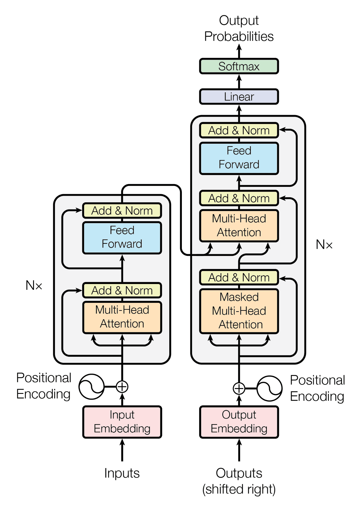
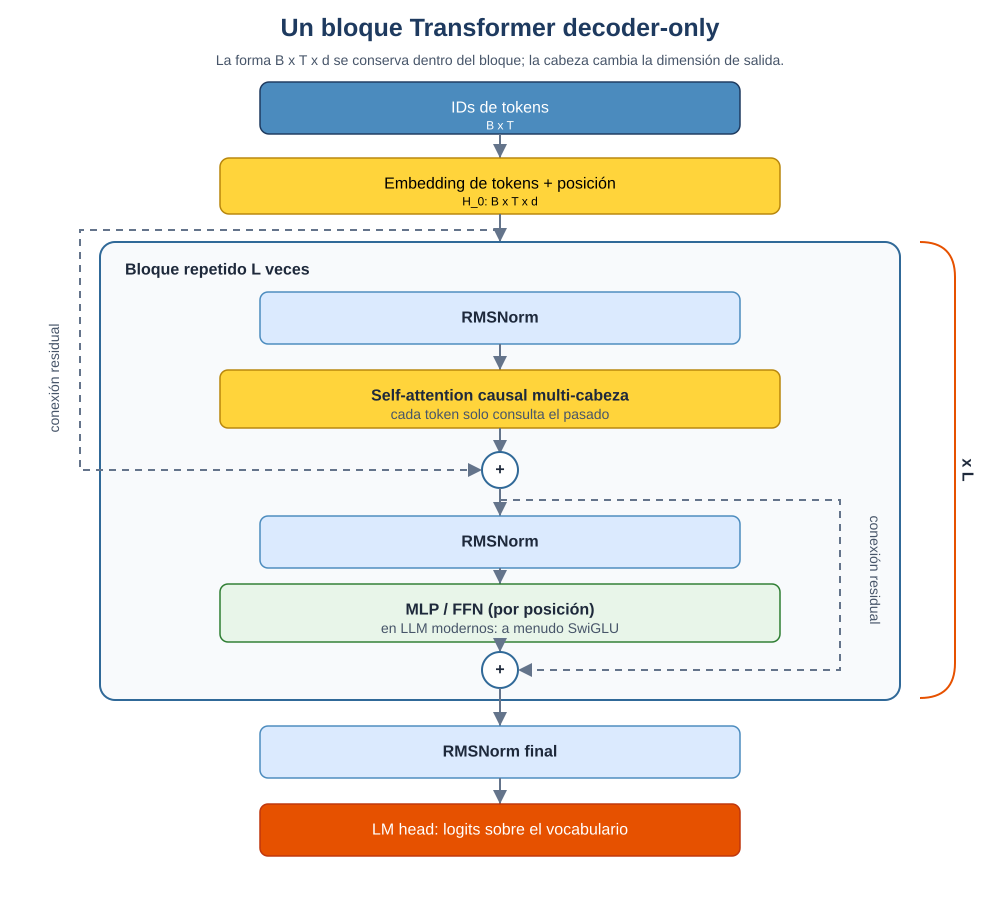
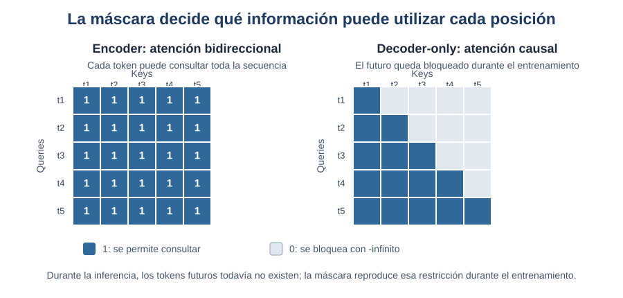
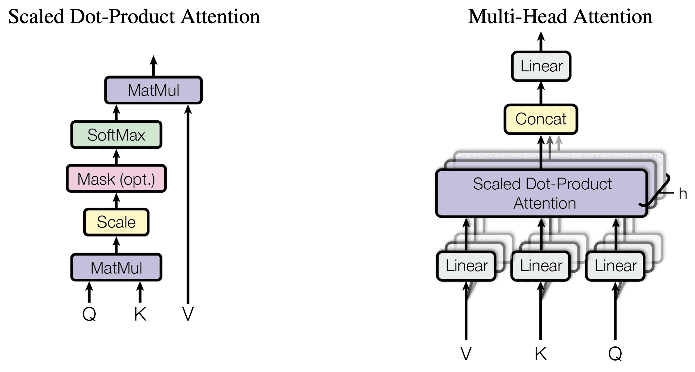

[](https://colab.research.google.com/github/Adamychen/m10_quarto/blob/main/notebooks/bloque1/01a-transformer.ipynb)

> Este tema forma parte del **Bloque 1 — Fundamentos**. 
> Se recomienda seguir el orden propuesto: Transformer → LLMs → Embeddings → Vector DB.

> Para situar esta arquitectura en la evolución de las representaciones, consulta antes el [panorama histórico: del texto a los embeddings](00-panorama.qmd). La sección explica por qué los embeddings de palabras son anteriores al Transformer y por qué BERT y SBERT aprovechan después esta arquitectura.

```{python}
#| echo: true
#| eval: false

!pip install -q matplotlib

```

```{python}
#| echo: true
#| eval: true

import os
os.environ["TOKENIZERS_PARALLELISM"] = "false"
import warnings
warnings.filterwarnings("ignore")
import numpy as np
import matplotlib.pyplot as plt
import torch
import torch.nn as nn
import torch.nn.functional as F
plt.rcParams["figure.dpi"] = 100
print("Librerías cargadas correctamente.")
```

## Arquitectura Transformer {#sec-arquitectura-transformer}

### El problema que resuelve {#sec-problema-resuelve}

Antes del Transformer, buena parte del procesamiento de lenguaje se apoyaba en modelos recurrentes como RNN, LSTM y GRU. Estos modelos actualizaban un estado oculto después de leer cada token, de modo que el procesamiento de una posición dependía del resultado de la posición anterior.

Ese diseño planteaba tres dificultades. La primera era la falta de paralelismo: no se podía procesar una secuencia completa de una sola vez. La segunda era el deterioro de las señales de gradiente en secuencias largas. La tercera era la dificultad de relacionar directamente dos tokens muy alejados, porque la información tenía que atravesar todos los estados intermedios.

El Transformer (@vaswani2017attention) sustituyó la recurrencia por atención. La atención permite que cada posición combine información de otras posiciones mediante una operación matricial que se puede calcular en paralelo durante el entrenamiento. Esta ventaja no elimina el coste: la atención densa compara pares de posiciones y su coste crece cuadráticamente con la longitud de la secuencia.

::: {.callout-tip}
## La idea de fondo

Una RNN transporta información paso a paso. Un Transformer construye cada representación consultando directamente otras posiciones, respetando la máscara de atención que corresponda.
:::

### Cómo funciona un Transformer de un vistazo {#sec-vistazo-transformer}

Un Transformer es una arquitectura que transforma una secuencia de representaciones en otra secuencia de representaciones. Según la variante y la cabeza de salida, puede producir embeddings, etiquetas de clasificación o una distribución de probabilidad sobre el vocabulario. En un LLM decoder-only, el recorrido se puede resumir así: texto → tokens → IDs → embeddings → bloques Transformer → logits → texto.

::: {#fig-pipeline-transformer}
```{mermaid}
flowchart LR
    A["Texto<br/>crudo"]:::input --> B[Tokenizer]:::proc
    B --> C["Token<br/>IDs"]:::doc
    C --> D["Embedding<br/>Layer"]:::proc
    D --> E["Capas<br/>Transformer<br/>(× L)"]:::proc
    E --> F["Logits<br/>sobre<br/>vocabulario"]:::doc
    F --> G[Decode]:::proc
    G --> H["Token<br/>generado"]:::out
    H -.->|"se añade al input<br/>(bucle autorregresivo)"| A

    classDef input fill:#4B8BBE,stroke:#1e3a5f,color:#fff,stroke-width:1.5px
    classDef proc  fill:#306998,stroke:#0d1f33,color:#fff,stroke-width:1.5px
    classDef doc   fill:#FFD43B,stroke:#b8860b,color:#000,stroke-width:1.5px
    classDef out   fill:#2e7d32,stroke:#0d3010,color:#fff,stroke-width:2px
```
:::

Durante la inferencia generativa, la salida se obtiene un token cada vez. La flecha discontinua muestra el bucle autorregresivo: el token recién generado se incorpora al contexto y el modelo calcula la siguiente distribución. Durante el entrenamiento, en cambio, una secuencia completa puede procesarse en paralelo mediante *teacher forcing* y una máscara causal.

::: {.callout-note}
## Las 4 etapas de la pipeline

1. **Tokenización** — el texto se divide en unidades subpalabra (tokens). Por ejemplo, *"unhappiness"* puede descomponerse en `["un", "happiness"]` o `["unhapp", "iness"]`. Cada token recibe un **ID entero** del vocabulario del modelo.
2. **Embedding** — cada ID se convierte en un **vector denso** de dimensión $d$ (típicamente $d = 4096$). Los vectores se eligen de modo que **conceptos similares caen cerca en el espacio vectorial**.
3. **Procesamiento contextual** — $L$ capas de Transformer transforman todos los estados en paralelo. En un encoder cada posición puede consultar toda la secuencia; en un decoder-only solo puede consultar las posiciones anteriores y la actual. Tras $L$ capas, cada posición codifica información contextual.
4. **Predicción** — el estado oculto final se proyecta a una distribución de probabilidad sobre todo el vocabulario, y una estrategia de *decoding* (temperatura, top-p, top-k) elige el siguiente token.

Las secciones que siguen desglosan **cómo** funciona cada etapa, empezando por la pieza central: la **atención multi-cabeza**.
:::

::: {.callout-tip}
## Lectura intuitiva: qué recordar

- Un Transformer no opera directamente con palabras: opera con vectores aprendidos.
- La atención permite mezclar información entre posiciones, pero la máscara determina qué posiciones están disponibles.
- La generación produce un token cada vez (autorregresiva), aunque el entrenamiento puede procesar muchas posiciones en paralelo.
:::

### Del Transformer original al decoder-only moderno {#sec-original-vs-moderno}

El artículo original de Vaswani et al. presentó un modelo encoder-decoder para tareas de secuencia a secuencia, como traducción y resumen. El encoder leía toda la entrada con atención bidireccional; el decoder generaba la salida de izquierda a derecha y utilizaba cross-attention para consultar las representaciones producidas por el encoder.

{#fig-arquitectura-transformer}

Los LLM generativos actuales suelen utilizar una variante decoder-only. En ella desaparecen el encoder y la cross-attention: una única pila de bloques con self-attention causal transforma el contexto disponible y produce los logits del siguiente token. Esto no significa que el decoder-only sea “el Transformer completo”; es una variante especializada para modelado de lenguaje causal.

| Variante | Máscara principal | Salida habitual | Ejemplos de uso |
|---|---|---|---|
| Encoder-only | Bidireccional | Representación contextual | Clasificación, NER, embeddings |
| Decoder-only | Causal | Logits del siguiente token | Generación, chat, código |
| Encoder-decoder | Encoder bidireccional + decoder causal + cross-attention | Secuencia de salida | Traducción, resumen, transformación de texto |

### Anatomía de un bloque moderno {#sec-bloque-transformer}

La unidad que se repite $L$ veces no es solamente una capa de atención. Un bloque moderno combina normalización, self-attention, conexiones residuales y una red feed-forward. En una configuración Pre-Norm, una forma simplificada de escribir sus dos subcapas es:

$$
\mathbf{x}' = \mathbf{x} + \operatorname{MHA}(\operatorname{RMSNorm}(\mathbf{x}))
$$

$$
\mathbf{x}_{\text{salida}} = \mathbf{x}' + \operatorname{MLP}(\operatorname{RMSNorm}(\mathbf{x}'))
$$

La figura @fig-bloque-decoder-only muestra el recorrido completo. La forma de la representación sigue siendo $B \times T \times d$ después de cada subcapa; la proyección al vocabulario aparece únicamente al final.

{#fig-bloque-decoder-only}

Las conexiones residuales transportan una copia de la representación alrededor de cada subcapa. Esto facilita que la red aprenda una modificación de la representación en lugar de tener que reconstruirla completamente en cada capa. La normalización mantiene las activaciones en una escala manejable y la MLP transforma cada posición de forma independiente.

La arquitectura original utilizaba normalmente Post-Norm, mientras que muchos LLM modernos utilizan Pre-Norm o RMSNorm. No son nombres de modelos distintos, sino órdenes diferentes de las mismas operaciones. La elección afecta a la estabilidad del entrenamiento y a la facilidad para optimizar redes muy profundas [@ba2016layernorm; @zhang2019rmsnorm].

### Atención multi-cabeza (Multi-Head Attention) {#sec-atencion-multi-cabeza}

El núcleo del Transformer se encuentra en el mecanismo de *scaled dot-product attention* (atención basada en el producto escalar). Dada una matriz de estados $X \in \mathbb{R}^{B \times T \times d}$, el modelo aprende tres proyecciones:

$$
Q = XW_Q, \qquad K = XW_K, \qquad V = XW_V
$$

Las matrices $Q$, $K$ y $V$ no son tres copias del texto. Son tres lecturas distintas de los mismos estados:

- **Q (Query):** qué información busca este token.
- **K (Key):** qué información ofrece cada token.
- **V (Value):** el contenido real de cada token.

A partir de estas proyecciones, la atención se calcula como:

$$
\operatorname{Attention}(Q,K,V)
= \operatorname{softmax}\left(\frac{QK^\mathsf{T}}{\sqrt{d_k}} + M\right)V
$$

El producto $QK^\mathsf{T}$ produce una puntuación para cada par de posiciones. El factor $\sqrt{d_k}$ evita que los productos escalares crezcan demasiado cuando aumenta la dimensión de las claves. La matriz $M$ representa la máscara: contiene ceros en las posiciones permitidas y $-\infty$ en las posiciones bloqueadas, de modo que el *softmax* les asigna probabilidad cero.

En un encoder bidireccional, normalmente no se bloquean posiciones por causalidad. En un decoder-only, la posición $t$ no puede consultar posiciones futuras. Esta diferencia determina si el modelo puede utilizar toda la secuencia para construir cada representación o si debe mantener el orden de generación.

La atención multi-cabeza divide la dimensión en $H$ subespacios. Cada cabeza calcula su propia atención y después sus resultados se concatenan y se proyectan:

$$
\operatorname{MHA}(X)
= \operatorname{Concat}(\operatorname{head}_1,\ldots,\operatorname{head}_H)W_O
$$

Las cabezas no vienen etiquetadas de antemano como “sintaxis” o “semántica”. Pueden aprender patrones diferentes, pero su interpretación debe hacerse con cautela.

{#fig-mascaras-atencion}

La figura @fig-mascaras-atencion muestra por qué la máscara es una restricción de información y no una operación adicional del bloque. El cálculo matricial puede ejecutarse en paralelo, pero cada posición solo recibe información de las celdas permitidas.

{#fig-sdpa-vs-mha}

#### Scaled Dot-Product Attention — Low Level (numpy) {#sec-sdpa-numpy}

La primera implementación calcula atención sin máscara para que se vea la operación básica. Después aplicamos una máscara causal a la misma función.

```{python}
#| echo: true
#| eval: true

def scaled_dot_product_attention_numpy(Q, K, V, mask=None):
    """Atención paso a paso con numpy. Muestra la matemática subyacente."""
    d_k = K.shape[-1]
    scores = np.matmul(Q, K.transpose(0, 2, 1))
    scores = scores / np.sqrt(d_k)
    if mask is not None:
        scores = np.where(mask, -np.inf, scores)
    scores = scores - np.max(scores, axis=-1, keepdims=True)
    weights = np.exp(scores) / np.sum(np.exp(scores), axis=-1, keepdims=True)
    output = np.matmul(weights, V)
    return output, weights

np.random.seed(42)
batch, seq_len, d_k = 1, 3, 4
Q = np.random.randn(batch, seq_len, d_k)
K = np.random.randn(batch, seq_len, d_k)
V = np.random.randn(batch, seq_len, d_k)

out_np, attn_np = scaled_dot_product_attention_numpy(Q, K, V)
print("Matriz de atención (numpy):")
print(np.round(attn_np[0], 3))
print("\nCada fila suma 1:", np.round(attn_np[0].sum(axis=1), 3))

causal_mask = np.triu(np.ones((seq_len, seq_len), dtype=bool), k=1)
_, attn_causal = scaled_dot_product_attention_numpy(Q, K, V, mask=causal_mask)
print("\nAtención causal (las posiciones futuras quedan a cero):")
print(np.round(attn_causal[0], 3))


```

#### Scaled Dot-Product Attention — High Level (PyTorch) {#sec-sdpa-torch}

```{python}
#| echo: true
#| eval: true

def scaled_dot_product_attention_torch(Q, K, V):
    """Atención paso a paso con PyTorch, equivalente a la versión numpy."""
    d_k = K.shape[-1]
    scores = torch.matmul(Q, K.transpose(-2, -1)) / torch.sqrt(torch.tensor(d_k, dtype=torch.float32))
    weights = torch.softmax(scores, dim=-1)
    output = torch.matmul(weights, V)
    return output, weights

Qt = torch.from_numpy(Q)
Kt = torch.from_numpy(K)
Vt = torch.from_numpy(V)

out_th, attn_th = scaled_dot_product_attention_torch(Qt, Kt, Vt)
print("Matriz de atención (PyTorch):")
print(np.round(attn_th.numpy()[0], 3))

print(f"\n¿Resultados idénticos? {np.allclose(out_np, out_th.numpy(), atol=1e-6)}")


```

#### Multi-Head Attention — Low Level (numpy) {#sec-mha-numpy}

```{python}
#| echo: true
#| eval: true

def multi_head_attention_numpy(Q, K, V, num_heads=2):
    """Multi-head atención desde cero: divide en cabezas, atiende, concatena, proyecta."""
    batch, seq_len, d_model = Q.shape
    d_k = d_model // num_heads

    Q_heads = Q.reshape(batch, seq_len, num_heads, d_k).transpose(0, 2, 1, 3)
    K_heads = K.reshape(batch, seq_len, num_heads, d_k).transpose(0, 2, 1, 3)
    V_heads = V.reshape(batch, seq_len, num_heads, d_k).transpose(0, 2, 1, 3)

    outputs, attn_weights = [], []
    for h in range(num_heads):
        scores = Q_heads[:, h] @ K_heads[:, h].swapaxes(-2, -1) / np.sqrt(d_k)
        weights = np.exp(scores) / np.sum(np.exp(scores), axis=-1, keepdims=True)
        outputs.append(weights @ V_heads[:, h])
        attn_weights.append(weights)

    concat = np.concatenate(outputs, axis=-1)
    return concat, attn_weights

Q_mh = np.random.randn(1, 3, 8)
K_mh = np.random.randn(1, 3, 8)
V_mh = np.random.randn(1, 3, 8)
out_mh, attn_mh = multi_head_attention_numpy(Q_mh, K_mh, V_mh, num_heads=2)
print(f"Salida multi-head: {out_mh.shape}")
print(f"Cabeza 0 pesos:\n{np.round(attn_mh[0][0], 3)}")
print(f"Cabeza 1 pesos:\n{np.round(attn_mh[1][0], 3)}")
print(f"\nCada cabeza atiende de forma distinta (diferentes pesos).")


```

#### Multi-Head Attention — High Level (PyTorch) {#sec-mha-torch}

```{python}
#| echo: true
#| eval: true

embed_dim = 8
num_heads = 2
mha = nn.MultiheadAttention(embed_dim=embed_dim, num_heads=num_heads, batch_first=True)

Qt_mh = torch.from_numpy(Q_mh).float()
Kt_mh = torch.from_numpy(K_mh).float()
Vt_mh = torch.from_numpy(V_mh).float()

out_th_mh, attn_th_mh = mha(Qt_mh, Kt_mh, Vt_mh, need_weights=True)
print(f"Salida nn.MultiheadAttention: {out_th_mh.shape}")
print(f"Pesos de atención:\n{np.round(attn_th_mh.detach().numpy(), 3)}")
print(f"\nParámetros entrenables de la capa: {sum(p.numel() for p in mha.parameters())}")


```

#### Visualización de atención {#sec-visualizacion-atencion}

```{python}
#| echo: true
#| eval: true

fig, axes = plt.subplots(1, 3, figsize=(14, 4))

axes[0].imshow(attn_np[0], cmap="Blues", vmin=0, vmax=1)
axes[0].set_title("Atención simple (numpy)")
axes[0].set_xticks(range(seq_len)); axes[0].set_yticks(range(seq_len))
axes[0].set_xticklabels([f"T{i}" for i in range(seq_len)])
axes[0].set_yticklabels([f"T{i}" for i in range(seq_len)])

axes[1].imshow(attn_mh[0][0], cmap="Blues", vmin=0, vmax=1)
axes[1].set_title("Multi-head: cabeza 0")
axes[1].set_xticks(range(seq_len)); axes[1].set_yticks(range(seq_len))

axes[2].imshow(attn_mh[1][0], cmap="Blues", vmin=0, vmax=1)
axes[2].set_title("Multi-head: cabeza 1")
axes[2].set_xticks(range(seq_len)); axes[2].set_yticks(range(seq_len))

plt.tight_layout()
plt.show()
plt.close(fig)


```

::: {.callout-warning}
## Atención no equivale a explicación

Un mapa de atención muestra cómo se distribuyen determinados pesos dentro de una capa y una cabeza. No demuestra por sí solo que esos tokens sean la causa de la respuesta del modelo. Para atribuir influencia hay que combinarlo con gradientes, ablaciones u otros métodos causales [@jain2019attention].
:::

### La red feed-forward: transformar cada posición {#sec-feed-forward}

La atención mezcla información entre posiciones, pero no sustituye a la transformación que se aplica dentro de cada posición. Esa segunda función es la red feed-forward, también llamada MLP o FFN:

$$
\operatorname{FFN}(\mathbf{x})
= W_2\,\sigma(W_1\mathbf{x}+\mathbf{b}_1)+\mathbf{b}_2
$$

La misma MLP se aplica de forma independiente a cada token. Por eso la atención tiene una función relacional, mientras que la MLP transforma el contenido de cada estado sin mezclar directamente posiciones distintas. En los LLM modernos es frecuente utilizar SwiGLU:

$$
\operatorname{SwiGLU}(\mathbf{x})
= W_2\left(\operatorname{SiLU}(W_1\mathbf{x})\odot W_3\mathbf{x}\right)
$$

Esta formulación utiliza una rama que modula a la otra mediante un producto elemento a elemento. Las FFN también se han interpretado como una forma de memoria asociativa: determinadas direcciones de entrada activan transformaciones que recuperan patrones aprendidos [@geva2021transformer]. Esta interpretación es útil como intuición, pero no significa que cada neurona almacene un hecho aislado.

### Normalización y conexiones residuales {#sec-normalizacion-residuales}

LayerNorm normaliza las características de un estado individual, no las observaciones de un lote:

$$
\operatorname{LayerNorm}(\mathbf{x})
= \boldsymbol{\gamma}\odot
\frac{\mathbf{x}-\mu}{\sqrt{\sigma^2+\epsilon}}
 + \boldsymbol{\beta}
$$

En muchos LLM actuales se utiliza RMSNorm, que elimina el centrado por la media:

$$
\operatorname{RMSNorm}(\mathbf{x})
= \boldsymbol{\gamma}\odot
\frac{\mathbf{x}}{\sqrt{\frac{1}{d}\sum_{i=1}^{d}x_i^2+\epsilon}}
$$

Las conexiones residuales añaden la entrada de una subcapa a su salida. Esta ruta directa facilita el flujo de gradientes a través de muchas capas. La diferencia entre las dos disposiciones más habituales es:

| Orden | Forma simplificada | Comentario |
|---|---|---|
| Post-Norm | `LayerNorm(x + SubLayer(x))` | Usado en el Transformer original; puede ser más difícil de estabilizar en redes profundas |
| Pre-Norm | `x + SubLayer(LayerNorm(x))` | Habitual en LLM modernos; ofrece una ruta residual directa |

En la práctica, los detalles exactos dependen del modelo. No todos los LLM emplean la misma normalización ni la misma variante de MLP [@ba2016layernorm; @zhang2019rmsnorm].

### Coste de la atención {#sec-coste-atencion}

La atención densa compara cada posición con todas las demás. Para una secuencia de longitud $T$, la matriz de puntuaciones tiene forma $T \times T$ y el coste aproximado de calcularla es:

$$
\text{tiempo} = O(T^2 d), \qquad
\text{memoria de la matriz} = O(T^2)
$$

El crecimiento cuadrático explica por qué duplicar la ventana de contexto no duplica, sino que cuadruplica aproximadamente el tamaño de la matriz de atención. En la práctica, el coste total también depende del número de capas, cabezas, dimensión oculta, precisión numérica y tamaño del lote.

::: {.callout-note}
## FlashAttention no cambia la arquitectura

FlashAttention reorganiza el cálculo en bloques para reducir movimientos de memoria y evitar materializar toda la matriz de atención en la memoria de la GPU [@dao2022flashattention]. Mejora la ejecución de la atención exacta, pero no convierte automáticamente el coste cuadrático en lineal. Las ventanas locales y las máscaras dispersas son decisiones diferentes.
:::

### MHA, MQA y GQA {#sec-mha-mqa-gqa}

En la atención multi-cabeza estándar, cada cabeza tiene sus propias proyecciones de consultas, claves y valores. En *Multi-Query Attention* (MQA), varias cabezas de consulta comparten las mismas claves y valores. *Grouped-Query Attention* (GQA) ocupa una posición intermedia: agrupa varias cabezas de consulta para compartir un conjunto más pequeño de cabezas K/V.

La ventaja aparece sobre todo durante la inferencia. El modelo debe conservar las claves y valores de los tokens anteriores en la caché KV; si hay menos cabezas K/V, esa caché ocupa menos memoria. Muchos LLM modernos utilizan GQA como compromiso entre calidad y coste [@grattafiori2024llama3].

La atención local, GQA y FlashAttention resuelven problemas distintos. La primera limita qué posiciones se consultan; la segunda reduce el número de representaciones K/V almacenadas; la tercera optimiza cómo se ejecuta el cálculo.

### Codificación posicional

Sin información posicional, la self-attention no distingue el orden de los tokens. Más precisamente, el mecanismo es equivariante a permutaciones: si permutamos la entrada y aplicamos la misma permutación a la salida, el resultado se transforma de forma coherente, pero no aparece ninguna noción de “antes” y “después”. Para inyectar esa información, el Transformer añade o incorpora una señal posicional.

La codificación posicional sinusoidal usa frecuencias diferentes para cada dimensión:

$$PE_{(pos, 2i)} = \sin(pos / 10000^{2i/d_{model}})$$
$$PE_{(pos, 2i+1)} = \cos(pos / 10000^{2i/d_{model}})$$

#### Codificación posicional — Low Level (numpy) {#sec-pe-numpy}

```{python}
#| echo: true
#| eval: true

def positional_encoding_numpy(seq_len, d_model):
    """Codificación posicional sinusoidal desde cero."""
    pos = np.arange(seq_len)[:, np.newaxis]
    i = np.arange(d_model)[np.newaxis, :]
    angle_rates = 1 / np.power(10000, (2 * (i // 2)) / d_model)
    pe = np.zeros((seq_len, d_model))
    pe[:, 0::2] = np.sin(pos * angle_rates[:, 0::2])
    pe[:, 1::2] = np.cos(pos * angle_rates[:, 1::2])
    return pe

pe_np = positional_encoding_numpy(50, 32)
fig, ax = plt.subplots(figsize=(8, 4))
im = ax.imshow(pe_np.T, cmap="RdBu", aspect="auto")
ax.set_xlabel("Posición del token")
ax.set_ylabel("Dimensión del embedding")
ax.set_title("Codificación posicional sinusoidal (numpy)")
plt.colorbar(im, ax=ax)
plt.tight_layout()
plt.show()
plt.close(fig)


```

#### Codificación posicional — High Level (PyTorch) {#sec-pe-torch}

```{python}
#| echo: true
#| eval: true

vocab_size = 50
d_model = 32
pos_embedding = nn.Embedding(vocab_size, d_model)

posiciones = torch.arange(vocab_size)
pe_aprendida = pos_embedding(posiciones).detach().numpy()

fig, axes = plt.subplots(1, 2, figsize=(14, 4))

axes[0].imshow(pe_np.T, cmap="RdBu", aspect="auto")
axes[0].set_title("Sinusoidal (fija)")
axes[0].set_xlabel("Posición"); axes[0].set_ylabel("Dimensión")

axes[1].imshow(pe_aprendida.T, cmap="RdBu", aspect="auto")
axes[1].set_title("nn.Embedding (aprendida)")
axes[1].set_xlabel("Posición")

plt.tight_layout()
plt.show()
plt.close(fig)
print("La versión aprendida se adapta a los datos; la sinusoidal es fija pero extrapola a secuencias más largas.")


```

### Posiciones relativas: RoPE y ALiBi {#sec-posiciones-relativas}

La codificación sinusoidal y la aprendida absoluta se incorporan normalmente a los embeddings. Los LLM modernos suelen utilizar alternativas que introducen la posición directamente en la atención. La más extendida es RoPE (*Rotary Position Embedding*), que rota las componentes de las consultas y las claves según su posición.

Si $R_m$ representa la rotación asociada a la posición $m$, RoPE calcula:

$$
Q'_m = R_m Q_m, \qquad K'_n = R_n K_n
$$

La propiedad importante es que el producto $Q_m'K_n'^{\mathsf{T}}$ incorpora información sobre la posición relativa $m-n$. No hace falta memorizar la derivación completa para entender su utilidad: la atención puede distinguir dos tokens por su contenido y por la distancia que los separa [@su2021roformer].

Otra alternativa es ALiBi, que no añade vectores posicionales, sino que incorpora un sesgo dependiente de la distancia directamente en los logits de atención. Favorece, de forma gradual, la atención a posiciones cercanas [@press2022train].

| Método | Cómo introduce la posición | Ventaja principal | Limitación principal |
|---|---|---|---|
| Sinusoidal | Suma funciones seno y coseno a los embeddings | No añade parámetros aprendibles | La extrapolación práctica es limitada |
| Absoluta aprendida | Aprende un vector para cada posición | Flexible en la longitud entrenada | Depende de una longitud máxima |
| RoPE | Rota Q y K según la posición | Relación relativa y buena compatibilidad con KV cache | Requiere estrategias de extensión para contextos mucho mayores |
| ALiBi | Añade un sesgo lineal a los scores | Sencillo y con buena extrapolación | Introduce una preferencia fuerte por la cercanía |

La codificación posicional no es un detalle cosmético. Cambia la geometría de las puntuaciones de atención y, por tanto, la forma en que el modelo utiliza el contexto.

### Variantes de la arquitectura {#sec-variantes}

: Comparativa de las tres variantes principales de la arquitectura Transformer {#tbl-variantes-transformer}

| Variante | Objetivo habitual | Ejemplos | Uso principal |
|---|---|---|---|
| Encoder-only | Modelado enmascarado o clasificación | BERT, RoBERTa | Clasificación, NER, embeddings |
| Decoder-only | Modelado causal del siguiente token | GPT, Llama, Qwen, Gemma | Generación de texto, chat y código |
| Encoder-decoder | Transformación de una secuencia en otra | T5, BART | Traducción, resumen y QA |

BERT es un ejemplo de encoder-only entrenado con objetivos bidireccionales [@devlin2019bert]. T5 representa la familia encoder-decoder que formula muchas tareas como transformación de texto a texto [@raffel2020t5]. Los LLM conversacionales actuales suelen pertenecer a la familia decoder-only, aunque sus etapas de instrucción y alineamiento se estudian por separado en [01e - Del estado oculto a la salida](01e-llm-por-dentro.qmd).

::: {#fig-variantes-transformer}
```{mermaid}
graph LR
    subgraph "Encoder-only (BERT)"
        A[Entrada] --> B[Encoder<br/>Bidireccional]
        B --> C[Clasificación / Embeddings]
    end
    subgraph "Decoder-only (GPT)"
        D[Entrada] --> E[Decoder<br/>Causal]
        E --> F[Texto generado]
    end
    subgraph "Encoder-Decoder (T5)"
        G[Entrada] --> H[Encoder]
        H --> I[Decoder]
        I --> J[Salida]
    end
```
:::

La elección no es una cuestión de antigüedad. Depende de la relación entre la entrada y la salida. Si necesitamos una representación contextual de toda la entrada, un encoder-only puede ser suficiente. Si queremos generar una continuación, un decoder-only ofrece una interfaz natural. Si la tarea tiene una entrada y una salida con papeles diferenciados, el encoder-decoder mantiene esa separación mediante cross-attention.

### Entrenamiento paralelo e inferencia autorregresiva {#sec-entrenamiento-inferencia}

En un modelo causal, la frase “predecir el siguiente token” describe el objetivo, no necesariamente el orden de las operaciones durante el entrenamiento. Dada una secuencia, se desplazan los objetivos una posición:

```text
Entrada:  [El, modelo, aprende, con, datos]
Objetivo:  [modelo, aprende, con, datos, nuevos]
```

El modelo puede calcular las predicciones de todas las posiciones en un único *forward pass*, siempre que la máscara causal impida que una posición consulte el futuro. Este procedimiento se conoce como *teacher forcing*: cada posición recibe como contexto los tokens reales anteriores, no los tokens que el modelo haya generado en pasos anteriores.

Durante la inferencia, la situación cambia. El modelo genera un token, lo añade al contexto y vuelve a producir una distribución. Los sistemas de producción suelen conservar las claves y valores ya calculados en una caché KV para no repetir todo el trabajo en cada paso. Así aparecen dos fases con perfiles distintos:

| Fase | Qué ocurre | Cuello de botella habitual |
|---|---|---|
| Prefill | Se procesa el prompt completo y se construye la caché KV | Cómputo y paralelismo |
| Decode | Se genera un token por secuencia y se consulta la caché | Memoria y ancho de banda |

::: {.callout-warning}
## Dos afirmaciones que no se contradicen

El Transformer procesa muchas posiciones en paralelo durante el entrenamiento, pero genera una respuesta token a token durante la inferencia. La máscara causal mantiene la misma restricción de información en las dos fases.
:::

::: {.callout-important}
## Lectura obligatoria

@vaswani2017attention

Leer secciones 3-5: Scaled Dot-Product Attention, Multi-Head Attention, Positional Encoding y el resumen de la arquitectura completa.
:::

---

> Continúa con **[01b-llms.qmd](01b-llms.qmd)** — Grandes Modelos de Lenguaje e inferencia.

# References

::: {#refs}
:::
