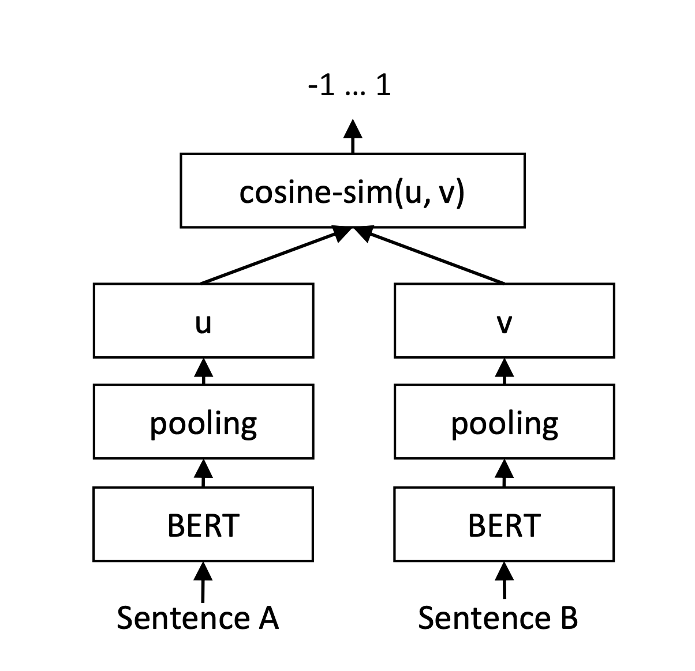
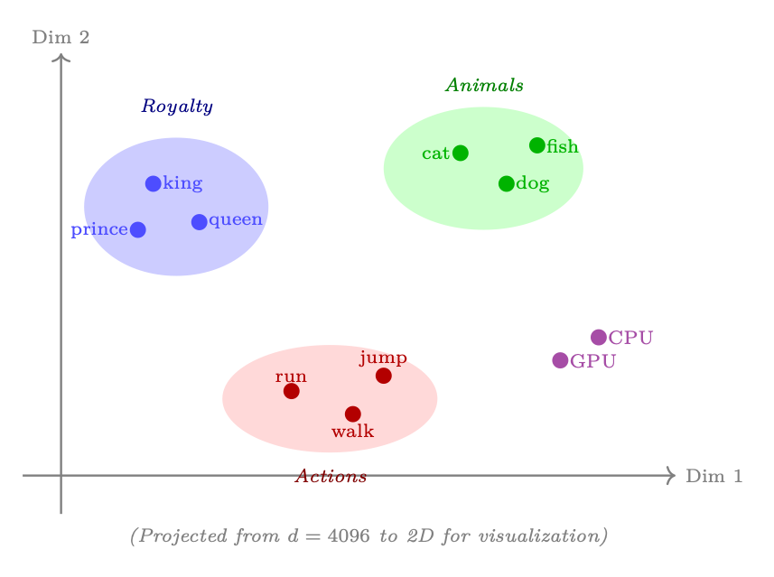

[](https://colab.research.google.com/github/Adamychen/m10_quarto/blob/main/notebooks/bloque1/01c-embeddings.ipynb)

> Este tema forma parte del **Bloque 1 — Fundamentos**. Se recomienda haber visto [01b-llms.qmd](01b-llms.qmd) primero.

> Este tema profundiza en la línea histórica presentada en el [panorama del Bloque 1](00-panorama.qmd). Allí se introducen one-hot, TF-IDF, word2vec, representaciones contextuales y SBERT; aquí se estudian sus mecanismos, modelos actuales y consecuencias geométricas.

```{python}
#| echo: true
#| eval: false

!pip install -q sentence-transformers matplotlib scikit-learn

```

```{python}
#| echo: true

import os
os.environ["TOKENIZERS_PARALLELISM"] = "false"
import warnings
warnings.filterwarnings("ignore")
import numpy as np
import matplotlib.pyplot as plt
plt.rcParams["figure.dpi"] = 100
print("Librerías cargadas correctamente.")

```

## 0. Qué significa «embedding» en este bloque {#sec-que-significa-embedding}

La palabra *embedding* se utiliza para varias piezas relacionadas, pero no idénticas. En todos los casos se trata de representar un objeto mediante un vector aprendido o calculado. Lo que cambia es el objeto representado, el momento del pipeline y el objetivo con el que se entrenó el vector.

| Tipo de representación | Entrada | Depende del contexto | Uso típico |
|---|---|---:|---|
| **Embedding de token** | ID de una unidad del vocabulario | No, al inicio del modelo | Entrada de un Transformer |
| **Estado oculto contextual** | Secuencia de tokens procesada | Sí | Clasificación, generación, extracción |
| **Embedding de palabra estático** | Palabra del vocabulario | No | Similitud léxica y transferencia |
| **Embedding de frase** | Frase o consulta completa | Sí, mediante el encoder | Búsqueda semántica |
| **Embedding de documento** | Documento o chunk | Sí, según el modelo y el pooling | Indexación y RAG |

Por tanto, no todo vector producido por un modelo es automáticamente un buen embedding para búsqueda. Un estado oculto puede contener información útil para predecir el siguiente token, pero necesitar una transformación o un entrenamiento adicional para que las distancias entre frases sean interpretables.

::: {.callout-warning}
## Tres conceptos que no conviene confundir

1. La tabla de embeddings convierte IDs en vectores al comienzo del Transformer.
2. Las capas Transformer convierten esos vectores en estados ocultos que incorporan contexto.
3. Un modelo como SBERT o E5 se entrena específicamente para que la distancia entre vectores de frases tenga utilidad para similitud y recuperación.

El [tema 01a](01a-transformer.qmd#sec-vistazo-transformer) muestra el recorrido interno, y [01e - Del estado oculto a la salida](01e-llm-por-dentro.qmd) explica cómo distintas cabezas pueden leer esos estados.
:::

## Modelos de Embeddings {#sec-modelos-embeddings}

### De word2vec a sentence embeddings {#sec-word2vec-sentence}

La evolución de la representación vectorial del lenguaje:

::: {#fig-timeline-embeddings}
```{mermaid}
timeline
    title Evolución de los embeddings
    1957 : Firth : Semántica distribucional
    1988 : TF-IDF : Representaciones dispersas ponderadas
    2003 : Bengio : Modelos neuronales con representaciones distribuidas
    2013 : word2vec (Mikolov) : Vectores por palabra
    2014 : GloVe (Pennington) : Vectores por palabra
    2017 : Transformer (Vaswani) : Atención y contexto
    2018 : ELMo (Peters) : Representaciones contextuales
    2018 : BERT (Devlin) : Embeddings contextuales
    2019 : Sentence-BERT (Reimers) : Embeddings de frases
    2020 : DPR y RAG : Recuperación densa y generación aumentada
    2022 : E5 (Microsoft) : Embeddings open-source
    2024 : text-embedding-3 (OpenAI) : Embeddings comerciales
    2024 : BGE-M3 (BAAI) : Multilingüe + multifunción
    2025 : Qwen3-Embedding : Embeddings nativos Qwen
```
:::

La cronología debe leerse como una sucesión de problemas y soluciones, no como una competición en la que cada modelo elimina por completo al anterior:

| Etapa | Problema dominante | Idea aportada | Limitación que permanece |
|---|---|---|---|
| One-hot y BoW | El texto no es numérico | Asignar coordenadas y contar palabras | No hay semántica ni contexto |
| TF-IDF | No todas las palabras son igual de informativas | Ponderar términos según su rareza | La similitud sigue siendo léxica |
| Word2vec y GloVe | Las palabras relacionadas aparecen en contextos parecidos | Aprender vectores densos | Un vector fijo por palabra |
| ELMo y BERT | El significado depende de la frase | Representaciones contextuales | No toda salida es adecuada para recuperación |
| SBERT y E5 | Hay que comparar frases y consultas eficientemente | Objetivos contrastivos y espacio compartido | La calidad depende del dominio y los datos |
| Vector DB y RAG | Hay demasiados vectores para comparar uno a uno | Índices ANN y recuperación aumentada | La recuperación puede fallar y debe evaluarse |

Las referencias originales de esta evolución se encuentran en @firth1957synopsis, @salton1988termweighting, @bengio2003neural, @mikolov2013word2vec, @pennington2014glove, @peters2018deep, @vaswani2017attention, @devlin2019bert, @reimers2019sbert, @karpukhin2020dpr y @wang2022e5.

::: {.callout-note}
## Idioma de los textos de ejemplo

Los modelos de embeddings que usamos en este bloque (`all-MiniLM-L6-v2`) están entrenados principalmente en **inglés**. Por eso los ejemplos de código utilizan texto en inglés. Cada modelo lleva asociado un **tokenizador** entrenado en su idioma: usar un tokenizador inglés sobre texto español produce más subtokens por palabra y embeddings de menor calidad, porque el espacio semántico aprendido está calibrado para relaciones del inglés.

Si necesitas trabajar con español, usa modelos multilingües como `intfloat/multilingual-e5-small` o `BAAI/bge-m3`. La API es la misma; solo cambia el nombre del modelo.
:::

### Del embedding estático al embedding contextual {#sec-estatico-contextual}

En un embedding estático, cada palabra tiene una única posición aprendida. En una representación contextual, la posición depende de los tokens que aparecen alrededor. Esta diferencia permite representar usos distintos de una misma forma ortográfica:

```text
El banco aprobó la hipoteca.
El banco estaba junto al río.
```

Un encoder contextual puede producir estados distintos para `banco` en cada frase. Esa capacidad no significa que el modelo haya construido una definición explícita en lenguaje natural. Significa que las capas han transformado la representación teniendo en cuenta las relaciones con el resto de la secuencia.

El paso desde estados por token a un único vector de frase exige además una operación de agregación. Las estrategias habituales incluyen:

- **Mean pooling:** promediar los estados de los tokens válidos.
- **CLS pooling:** utilizar el estado de un token especial, cuando el modelo lo ha entrenado para ello.
- **Pooling aprendido:** combinar los estados mediante una capa entrenable.
- **Representación contrastiva:** entrenar el encoder para que pares relevantes queden próximos y pares no relevantes queden separados.

La elección del pooling y del objetivo de entrenamiento puede cambiar sustancialmente la calidad de la búsqueda, incluso cuando el backbone Transformer es el mismo.

### Semántica distribucional {#sec-semantica-distribucional}

El principio fundamental: **"You shall know a word by the company it keeps"** (@firth1957synopsis). Palabras con contextos similares tienen significados similares, y por tanto vectores cercanos en el espacio semántico.

```{python}
#| echo: true

from sentence_transformers import SentenceTransformer

model = SentenceTransformer("all-MiniLM-L6-v2")

frases = [
    "A cat plays in the garden",
    "A feline chases a butterfly",
    "The dog sleeps on the rug",
    "Tomorrow will be a sunny day"
]

embeddings = model.encode(frases)
print(f"Forma de los embeddings: {embeddings.shape}")
print(f"Dimensión: {embeddings.shape[1]}")
print(f"Número de frases: {embeddings.shape[0]}")

```

```{python}
#| echo: true

from sklearn.metrics.pairwise import cosine_similarity

sim_matrix = cosine_similarity(embeddings)

fig, ax = plt.subplots(figsize=(5, 4))
im = ax.imshow(sim_matrix, cmap="Blues", vmin=0, vmax=1)
ax.set_xticks(range(len(frases)))
ax.set_yticks(range(len(frases)))
ax.set_xticklabels([f"F{i}" for i in range(len(frases))])
ax.set_yticklabels([f"F{i}" for i in range(len(frases))])
ax.set_title("Similitud coseno entre frases")

for i in range(len(frases)):
    for j in range(len(frases)):
        ax.text(j, i, f"{sim_matrix[i, j]:.2f}", ha="center", va="center")

plt.colorbar(im, ax=ax)
plt.tight_layout()
plt.show()

print("Notice how animal-related phrases (0, 1) have high similarity")
print("while the weather phrase (3) is different from the rest.")

```

### Sentence-BERT {#sec-sbert}

Sentence-BERT (SBERT) modifica BERT con una arquitectura **siamese** que permite generar embeddings de frases comparables directamente. Usa funciones de pérdida contrastiva (triplet loss, cosine similarity loss) para que frases semánticamente cercanas tengan vectores cercanos.

{#fig-sbert-arch fig-cap="Arquitectura siamesa de SBERT para inferencia: dos torres BERT con pesos compartidos producen embeddings u y v que se comparan con cosine similarity. Adaptada de @reimers2019sbert, Figure 2 (https://aclanthology.org/D19-1410/), distribuida bajo CC-BY 4.0."}

### Comparativa de modelos de embeddings {#sec-comparativa-embeddings}

: Comparativa de modelos de embeddings por dimensiones, tamaño y caso de uso {#tbl-modelos-embeddings}

| Modelo | Dimensiones | Tamaño | Uso |
|---|---|---|---|
| `all-MiniLM-L6-v2` | 384 | ~80 MB | Prototipado rápido |
| `intfloat/e5-small-v2` | 384 | ~120 MB | Propósito general open-source |
| `intfloat/e5-base-v2` | 768 | ~440 MB | Mayor precisión |
| `qwen3-embedding:0.6b` | 768 | ~640 MB | Embeddings nativos Qwen (disponible en Llamus) |
| `nomic-embed-text-v2-moe` | 768 | ~475 MB | Alta precisión, MoE eficiente |
| `mxbai-embed-large:v1` | 1024 | ~334 MB | Embeddings densos generales |
| `text-embedding-3-small` | 512 o 1536 | API | Comercial (OpenAI) |
| `text-embedding-3-large` | 256 o 3072 | API | Alta precisión (OpenAI) |

### Embeddings multimodales y tabulares {#sec-multimodales-tabulares}

- **Multimodales (CLIP):** proyectan texto e imágenes en un mismo espacio vectorial, permitiendo búsqueda cross-modal (ej. "un perro jugando en la nieve" → imágenes correspondientes).
- **Tabulares (TabNet, SCARF):** generan embeddings de filas de datos tabulares usando atención, útiles para búsqueda semántica sobre datos estructurados (ej. encontrar clientes similares por perfil de compra).

::: {.callout-info}
## ¿Cuándo usar cada uno?

    - **Texto:** Sentence-BERT / E5 → **Vector DB**
    - **Texto + imágenes:** CLIP → **Búsqueda multimodal**
    - **Datos tabulares:** TabNet / SCARF → **Búsqueda por perfil**
    - **Código:** CodeBERT / GraphCodeBERT → **Búsqueda semántica de código**
:::

### La geometría del espacio semántico {#sec-geometria-semantica}

La intuición central de los embeddings es que **la proximidad vectorial codifica proximidad semántica**. En un espacio bien entrenado:

- Conceptos similares caen **cerca** (rey, reina, príncipe).
- Conceptos distintos caen **lejos** (rey, bicicleta, GPU).
- Las **relaciones** entre conceptos se pueden capturar con **aritmética vectorial**:
  $\vec{\text{king}} - \vec{\text{man}} + \vec{\text{woman}} \approx \vec{\text{queen}}$.

{#fig-embedding-space-2d}

::: {#fig-analogia-vectorial}
```{mermaid}
flowchart LR
    K["king"]:::royalty -->|"− man"| K2["king − man"]:::diff
    M["man"]:::person --> K2
    K2 -->|"+ woman"| K3["king − man + woman"]:::result
    W["woman"]:::person --> K3
    K3 -.->|"≈"| Q["queen"]:::royalty

    classDef royalty fill:#c5cae9,stroke:#3949ab,color:#1a237e,stroke-width:1.5px
    classDef person  fill:#ffe0b2,stroke:#e65100,color:#000,stroke-width:1.5px
    classDef diff    fill:#fff9c4,stroke:#f9a825,color:#000,stroke-width:1.5px
    classDef result  fill:#c8e6c9,stroke:#2e7d32,color:#1b5e20,stroke-width:2px
```
:::

::: {.callout-note}
## Lectura de la imagen y el diagrama

La imagen proyecta 4096 dimensiones del espacio de embeddings en un plano 2D —pierde información exacta— pero conserva la **estructura por clusters**: las palabras se agrupan por tema, no por sintaxis. El diagrama Mermaid ilustra la **analogía vectorial**: el vector `king − man + woman` aterriza cerca de `queen`, porque la dirección `man → woman` (género) se suma a la dirección de `royalty` implícita en `king`. Esta es la propiedad que un sistema RAG explota cuando busca el documento "más similar" a una consulta.
:::

---

> Continúa con **[01d-vectordb.qmd](01d-vectordb.qmd)** — Bases de datos vectoriales.

# References

::: {#refs}
:::
