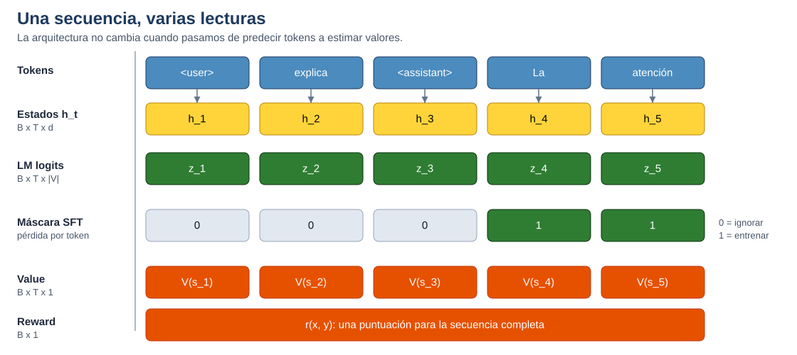
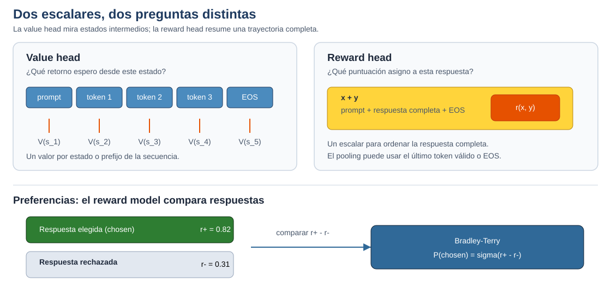

> Este tema forma parte del Bloque 1 - Fundamentos.
> Se recomienda leerlo después de [01a - Arquitectura Transformer](01a-transformer.qmd) y [01b - LLMs e inferencia](01b-llms.qmd).
>
> Tiempo estimado: 1 h.

::: {.callout-note}
## Qué aprenderás

En [01a - Cómo funciona un Transformer de un vistazo](01a-transformer.qmd#sec-vistazo-transformer) vimos cómo una secuencia de tokens se transforma en estados ocultos contextualizados. En esta página seguimos el recorrido hasta la salida del modelo.

La idea central es sencilla, pero conviene separar dos niveles que suelen mezclarse:

- El *backbone* es el conjunto de capas Transformer que construye una representación contextual para cada posición.
- Una cabeza de salida transforma esas representaciones en el resultado que necesita una tarea.
- SFT, PPO y DPO no son cabezas distintas, sino procedimientos y objetivos de entrenamiento.

Esta distinción permite entender por qué un mismo modelo puede producir tokens, estimar el valor de un estado o puntuar una respuesta.
:::

## 1. Del texto a los estados ocultos {#sec-estados-ocultos}

Para concretar la explicación, pensemos en un Transformer causal de tipo *decoder-only*. Después de procesar una secuencia de longitud $T$, el *backbone* produce una matriz de estados ocultos:

$$
H = (\mathbf{h}_1, \mathbf{h}_2, \ldots, \mathbf{h}_T)
\in \mathbb{R}^{B \times T \times d}
$$

Aquí, $B$ es el tamaño del lote, $T$ la longitud de la secuencia y $d$ la dimensión del modelo. Cada vector $\mathbf{h}_t$ resume la información que el modelo ha construido en la posición $t$. En un modelo causal, esa información solo puede depender de los tokens anteriores y del token actual.

El *backbone* no produce directamente una respuesta en lenguaje natural. Produce representaciones numéricas que otra capa debe interpretar. Esa capa es la cabeza de salida.

::: {#fig-backbone-cabezas fig-cap="El backbone produce estados ocultos que distintas cabezas transforman en salidas diferentes."}
```{mermaid}
flowchart LR
    A[Tokens]:::input --> B[Backbone<br/>Transformer<br/>x L capas]:::proc
    B --> C["H<br/>estados ocultos<br/>contextualizados"]:::doc
    C --> D{Cabeza de<br/>salida}:::proc
    D -->|LM head| E["Logits por token<br/>B x T x vocabulario"]:::out
    D -->|Value head| F["Valor por estado<br/>B x T x 1"]:::obs
    D -->|Reward head| G["Puntuación por secuencia<br/>B x 1"]:::obs

    classDef input fill:#4B8BBE,stroke:#1e3a5f,color:#fff,stroke-width:1.5px
    classDef proc  fill:#306998,stroke:#0d1f33,color:#fff,stroke-width:1.5px
    classDef doc   fill:#FFD43B,stroke:#b8860b,color:#000,stroke-width:1.5px
    classDef out   fill:#2e7d32,stroke:#0d3010,color:#fff,stroke-width:2px
    classDef obs   fill:#e65100,stroke:#bf360c,color:#fff,stroke-width:1.5px
```
:::

Como muestra @fig-backbone-cabezas, las cabezas no reciben necesariamente la misma parte de $H$. La *LM head* utiliza todos los estados para producir una distribución por token; la *value head* suele producir un valor por posición; la *reward head* resume la secuencia completa en un único escalar.

La separación es conceptual. En una implementación concreta, el *backbone* puede congelarse, ajustarse mediante adaptadores o copiarse para formar modelos especializados. Lo importante es distinguir la representación compartida de la capa que la convierte en una salida.

::: {.callout-tip}
## Una regla útil

Si la salida es una distribución sobre tokens, probablemente estamos ante una *LM head*. Si la salida es un escalar que resume un estado o una secuencia, probablemente estamos ante una cabeza de valor o de recompensa.
:::

## 2. LM head: predecir el siguiente token {#sec-lm-head}

La *LM head* es una proyección lineal desde la dimensión del modelo hasta el tamaño del vocabulario. Para cada posición, transforma el estado oculto en un vector de logits:

$$
\mathbf{z}_t = W_{\text{LM}}\mathbf{h}_t + \mathbf{b}
\in \mathbb{R}^{|\mathcal{V}|}
$$

La función *softmax* convierte esos logits en probabilidades:

$$
P(x_{t+1} \mid x_{\leq t})
= \operatorname{softmax}(\mathbf{z}_t)
$$

El modelo no genera una frase completa de una sola vez. En cada paso calcula una distribución, selecciona o muestrea un token y lo incorpora al contexto. Después vuelve a calcular la salida para predecir el siguiente token.

Durante el preentrenamiento, la pérdida causal compara la distribución producida en cada posición con el token que debería aparecer a continuación:

$$
\mathcal{L}_{\text{LM}}
= -\frac{1}{T}\sum_{t=1}^{T}
\log P(x_{t+1}\mid x_{\leq t})
$$

Por eso la salida de la *LM head* tiene una dimensión grande: si el vocabulario contiene $|\mathcal{V}|$ tokens, cada posición produce ese número de logits.

{#fig-alineacion-sft}

La figura @fig-alineacion-sft reúne las salidas en una misma secuencia. La fila de logits conserva una salida para cada posición; la máscara SFT selecciona cuáles de esas posiciones contribuyen a la pérdida; la *value head* mantiene una estimación por estado; y la *reward head* resume la trayectoria completa en un único escalar.

### Weight tying {#sec-weight-tying}

Muchos LLM comparten los pesos de la tabla de embeddings con la proyección de salida. En ese caso:

$$
W_{\text{LM}} = E^{\mathsf{T}}
$$

Esta decisión reduce el número de parámetros y conecta geométricamente la representación de entrada con la representación de salida. No es una propiedad obligatoria, pero sí una práctica habitual en modelos de lenguaje causales.

## 3. SFT: la misma LM head, una pérdida distinta {#sec-sft-misma-lm-head}

El ajuste fino supervisado, o SFT (*Supervised Fine-Tuning*), enseña al modelo a responder a instrucciones mediante ejemplos de conversación o de formato instrucción-respuesta. No requiere una cabeza arquitectónica nueva: se sigue utilizando la *LM head*.

Lo que cambia es el conjunto de datos y la máscara de la pérdida. El prompt proporciona el contexto, pero normalmente se calcula la pérdida solo sobre los tokens que debe producir el asistente:

$$
\mathcal{L}_{\text{SFT}}
= -\frac{1}{\sum_{t=1}^{T}m_t}
\sum_{t=1}^{T}m_t\log P(y_t\mid x, y_{<t})
$$

La máscara $m_t$ vale cero para los tokens que no queremos utilizar como objetivo y uno para los tokens de la respuesta. En muchas implementaciones, los objetivos ignorados se representan con el valor `-100`.

| Token | `<user>` | `explica` | `<assistant>` | `La` | `atención` |
|---|---:|---:|---:|---:|---:|
| Máscara $m_t$ | 0 | 0 | 0 | 1 | 1 |
| Etiqueta | `-100` | `-100` | `-100` | `La` | `atención` |

El formato conversacional también importa. Los tokens especiales, las plantillas de chat y la forma de separar las intervenciones indican al modelo qué parte corresponde al usuario y cuál al asistente. La máscara no convierte por sí sola un modelo en un asistente; funciona junto con datos de instrucciones y un procedimiento de entrenamiento supervisado.

::: {.callout-important}
## SFT no es una cuarta cabeza

La expresión “SFT head” resulta cómoda como abreviatura, pero es arquitectónicamente imprecisa. SFT describe una fase de entrenamiento de la *LM head*, no una capa de salida independiente.
:::

## 4. Value head: estimar el valor de un estado {#sec-value-head}

En aprendizaje por refuerzo, el modelo necesita algo más que una distribución sobre tokens. También puede necesitar una estimación de lo prometedor que es el estado actual. La función de valor de una política $\pi$ se define como el retorno esperado a partir de ese estado:

$$
V^{\pi}(s_t)
= \mathbb{E}_{\pi}\left[
\sum_{k=0}^{\infty}\gamma^k r_{t+k}
\mid s_t
\right]
$$

Una *value head* suele ser una capa lineal $d \to 1$ aplicada a cada estado oculto:

$$
V(s_t) = \mathbf{w}_{\text{value}}^{\mathsf{T}}\mathbf{h}_t + b
\in \mathbb{R}
$$

La *value head* no sustituye necesariamente a la *LM head*. En un modelo actor-crítico, ambas ramas pueden coexistir:

```text
Backbone
|-- LM head       -> distribución de acciones, normalmente tokens
`-- Value head    -> V(s_t), valor estimado del estado
```

La política utiliza los logits para elegir tokens. El crítico utiliza los valores para calcular ventajas y estabilizar la actualización de la política. En PPO, por ejemplo, la pérdida de valor puede expresarse como un error cuadrático entre el valor predicho y un retorno estimado:

$$
\mathcal{L}_{V}
= \frac{1}{T}\sum_{t=1}^{T}
\left(V(s_t)-R_t\right)^2
$$

La forma exacta de la cabeza y su inicialización dependen de la biblioteca y del algoritmo. Lo esencial es que produce un escalar por estado y que su función es distinta de la predicción del siguiente token.

{#fig-value-reward}

Como muestra @fig-value-reward, la *value head* responde a una pregunta local: qué retorno se espera desde cada estado. La *reward head* responde a una pregunta global: qué puntuación recibe la respuesta completa. El modelo de recompensa puede comparar después dos respuestas mediante la diferencia entre sus puntuaciones.

## 5. Reward head: puntuar una respuesta {#sec-reward-head}

Un modelo de recompensa asigna una puntuación a una respuesta completa. Se entrena a partir de preferencias: dada una entrada $x$, una persona o un proceso de evaluación indica cuál de dos respuestas es preferible, $y^+$ o $y^-$.

El modelo de recompensa puede compartir una arquitectura de lenguaje con el modelo base y sustituir la proyección al vocabulario por una capa escalar. En modelos *decoder-only* es habitual utilizar el estado del último token válido, el token de fin de secuencia o alguna forma de *pooling*:

$$
r_{\theta}(x,y)
= \mathbf{w}_{\text{reward}}^{\mathsf{T}}\mathbf{h}_{\text{pool}} + b
\in \mathbb{R}
$$

En el modelo de Bradley-Terry, la probabilidad de preferir la respuesta elegida se modela como:

$$
P(y^+ \succ y^- \mid x)
= \sigma\left(
r_{\theta}(x,y^+) - r_{\theta}(x,y^-)
\right)
$$

La pérdida correspondiente es:

$$
\mathcal{L}_{\text{RM}}
= -\log \sigma\left(
r_{\theta}(x,y^+) - r_{\theta}(x,y^-)
\right)
$$

La puntuación no debe interpretarse automáticamente como una medida absoluta de calidad. El objetivo principal es ordenar respuestas de acuerdo con los patrones de preferencia presentes en los datos.

## 6. PPO y DPO: dos rutas de optimización {#sec-ppo-dpo}

La *reward head* y la *value head* aparecen sobre todo cuando se utiliza una ruta de aprendizaje por refuerzo como PPO. La relación entre componentes y fases se entiende mejor separando las dos rutas:

::: {#fig-rutas-preferencias fig-cap="PPO y DPO utilizan las preferencias mediante rutas de optimización diferentes."}
```{mermaid}
flowchart LR
    PREF["Preferencias<br/>chosen / rejected"]:::doc

    subgraph PPO_route["Ruta PPO / RLHF"]
        P1["Política tras SFT"]:::input --> Y1["Respuesta<br/>generada"]:::doc
        Y1 --> RM["Reward model<br/>r(x,y)"]:::proc
        P1 --> VH["Value head<br/>V(s_t)"]:::proc
        RM --> PPO["PPO<br/>recompensa + ventajas"]:::obs
        VH --> PPO
        PPO --> OUT1["Política<br/>actualizada"]:::out
    end

    subgraph DPO_route["Ruta DPO"]
        P2["Política tras SFT"]:::input --> DPO["DPO<br/>pérdida directa"]:::proc
        REF["Política de<br/>referencia"]:::doc --> DPO
        DPO --> OUT2["Política<br/>actualizada"]:::out
    end

    PREF --> RM
    PREF --> DPO

    classDef input fill:#4B8BBE,stroke:#1e3a5f,color:#fff,stroke-width:1.5px
    classDef proc  fill:#306998,stroke:#0d1f33,color:#fff,stroke-width:1.5px
    classDef doc   fill:#FFD43B,stroke:#b8860b,color:#000,stroke-width:1.5px
    classDef out   fill:#2e7d32,stroke:#0d3010,color:#fff,stroke-width:2px
    classDef obs   fill:#e65100,stroke:#bf360c,color:#fff,stroke-width:1.5px
```
:::

En RLHF con PPO, el *reward model* transforma la respuesta en una señal de recompensa y la *value head* ayuda a estimar las ventajas durante la actualización de la política. Esta familia de métodos se popularizó en trabajos de alineamiento con preferencias humanas [@ouyang2022training; @schulman2017proximal].

DPO (*Direct Preference Optimization*) utiliza directamente los pares de preferencias y una política de referencia congelada. No necesita entrenar un *reward model* separado como paso intermedio [@rafailov2023direct]. Por tanto, no conviene presentar la *reward head* como una pieza necesaria de todo sistema de alineamiento.

## 7. Dónde encaja LoRA {#sec-cabezas-y-lora}

El ajuste eficiente de parámetros introduce otra distinción. LoRA (*Low-Rank Adaptation*) no significa necesariamente entrenar solo la cabeza de salida. Lo habitual es añadir matrices de bajo rango en módulos seleccionados del *backbone*, por ejemplo en las proyecciones de consulta y valor de la atención [@hu2022lora].

El modelo base puede permanecer congelado mientras se entrenan esos adaptadores. El resultado sigue utilizando la misma LM head, pero el *backbone* produce estados ocultos diferentes porque los adaptadores han modificado su transformación. En prompt tuning, en cambio, se aprenden vectores adicionales que se incorporan a la entrada [@lester2021prompttuning].

La explicación detallada de LoRA aparece en [03c - Fine-tuning eficiente](../bloque3/03c-fine-tuning.qmd#sec-lora). Aquí basta con conservar la separación:

| Concepto | Qué describe |
|---|---|
| Cabeza | Componente que transforma estados ocultos en una salida |
| SFT | Objetivo supervisado para entrenar una política |
| LoRA | Forma de adaptar determinados pesos con pocos parámetros |
| PPO | Algoritmo de optimización mediante aprendizaje por refuerzo |
| DPO | Optimización directa a partir de preferencias |

## 8. Resumen: tres cabezas y varias fases {#sec-resumen-cabezas}

La comparación arquitectónica se resume en @tbl-cabezas-resumen. SFT aparece como fase de entrenamiento, no como una cabeza adicional.

: Componentes de salida y objetivos de entrenamiento {#tbl-cabezas-resumen}

| Componente o fase | Salida principal | Señal de entrenamiento | Función |
|---|---|---|---|
| LM head | Un vector de logits por posición | Cross-entropy causal | Predecir el siguiente token |
| SFT | La misma salida de la LM head | Cross-entropy enmascarada | Aprender a seguir instrucciones |
| Value head | Un escalar por estado | Error sobre retornos estimados | Estimar el valor para el crítico |
| Reward head | Un escalar por secuencia | Preferencias entre respuestas | Ordenar respuestas según una señal de recompensa |
| PPO | Política más value head y reward model | Objetivo de aprendizaje por refuerzo | Optimizar la política mediante recompensas |
| DPO | Política y referencia | Pares de preferencias | Optimizar directamente la preferencia relativa |

::: {.callout-tip}
## La idea que conviene conservar

El *backbone* construye representaciones contextuales. La cabeza determina cómo se leen esas representaciones. SFT, PPO, DPO y LoRA describen formas de entrenar o adaptar el sistema; no son nombres alternativos para cabezas de salida.
:::

Esta distinción conecta la página con el resto del módulo:

- En el Bloque 2, las llamadas a un LLM utilizan la política y su *LM head* para producir tokens.
- En el Bloque 3, SFT y LoRA permiten adaptar el comportamiento a instrucciones o datos de dominio.
- En el Bloque 4, los modelos de recompensa y los evaluadores *LLM-as-a-judge* pueden proporcionar señales de evaluación, pero no son equivalentes por definición.

La pregunta práctica que debe guiar la lectura de un paper es: ¿qué representación produce el modelo, qué salida se calcula a partir de ella y con qué señal se entrenan sus parámetros?

---

> Has terminado esta lectura del Bloque 1. Continúa con [HPD 1 - Pipeline de embeddings y búsqueda semántica](hpd1-embeddings.qmd).

# References

::: {#refs}
:::
